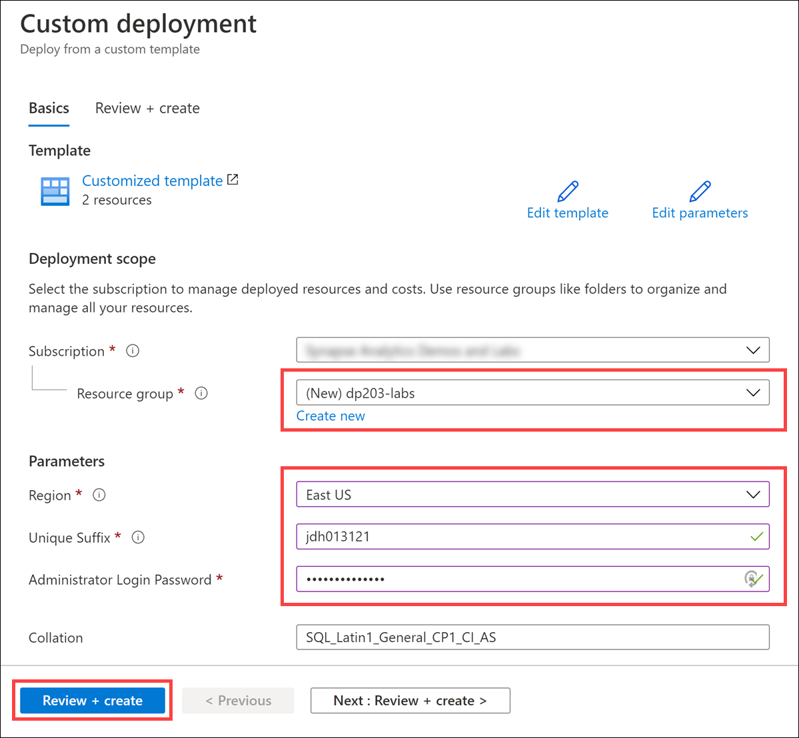
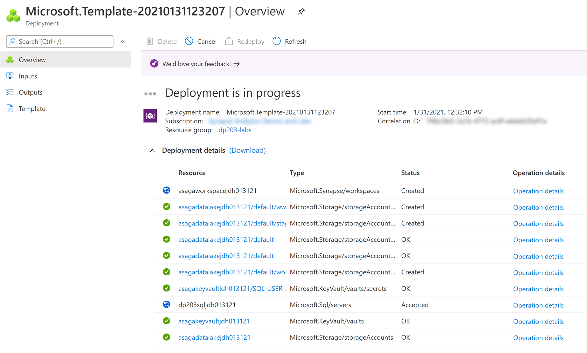

# Module 2 setup

## Pre-requisites for deployment

The following requirements must be met before the deployment:

- A resource group (this will be provided during the deployment process).

    >**IMPORTANT**
    >
    >In case you didn't create the resource group yourself, make sure your account has the `Owner` role on the resource group.
    >
    >Also, your account (i.e. the Azure AD account used to deploy the Azure Synapse Analytics workspace) must have permissions to create new resource groups in the subscription (this is required because Synapse Analytics requires an additional resource group to keep various hidden artifacts; this resource group is created during the deployment process).

- A unique suffix to be used when generating the name of the workspace. All workspaces deployed using the templates in this repo are named `asagaworkspace<unique_suffix>`, where `<unique_suffix>` gets replaced with the value you provide. Make sure the unique suffix is specific enough to avoid potential naming collisions (i.e. avoid using common values like `01`, `1`, `test`, etc.).
- A password for the SQL admin account of the workspace. Make sure you save the password in a secure location (like a password manager) as you will need to use it later.
- A GitHub account to access the GitHub repository.

## Deploy Azure resources

Click the `Deploy to Azure` button below to start the deployment process.

You should see next the `Custom deployment` screen where you need to provide the following (see [Pre-requisites for deployment](#pre-requisites-for-deployment) above for details):

- The resource group where the Synapse Analytics workspace will be deployed (create a new one if needed).
- The unique suffix used to generate the name of the workspace (**NOTE**: Make sure this value has a **maximum** length of **9 characters**).
- The password for the SQL Administrator accounts (both the Azure SQL Database source and Synapse Analytics dedicated SQL pool destination).
- **(Optional)** change the source Azure SQL Database collation setting if desired.

Select `Review + create` to validate the settings.

Once the validation is passed, select `Create` to start the deployment. You should see next an indication of the deployment progress:

Wait until the deployment completes successfully before proceeding to the next step.
