# Demo setup: Realize Integrated Analytical Solutions with Azure Synapse Analytics

**Contents**

<!-- TOC -->

- [Demo setup: Realize Integrated Analytical Solutions with Azure Synapse Analytics](#demo-setup-realize-integrated-analytical-solutions-with-azure-synapse-analytics)
  - [Requirements](#requirements)
  - [Lab VM](#lab-vm)
  - [Environment setup instructions](#environment-setup-instructions)
  - [Azure Setup](#azure-setup)
    - [Task 1: Create a resource group in Azure](#task-1-create-a-resource-group-in-azure)
    - [Task 2: Create an Azure VM for the deployment scripts](#task-2-create-an-azure-vm-for-the-deployment-scripts)
    - [Task 4: Create Azure Synapse Analytics workspace](#task-4-create-azure-synapse-analytics-workspace)
  - [Before starting](#before-starting)
  - [Steps & Timing](#steps--timing)
    - [Task 1: Pre-requisites](#task-1-pre-requisites)
    - [Task 2: Download artifacts and install PowerShell modules](#task-2-download-artifacts-and-install-powershell-modules)
    - [Task 3: Execute setup scripts](#task-3-execute-setup-scripts)
      - [Potential errors that you can ignore](#potential-errors-that-you-can-ignore)
    - [Task 4: Pause SQL pool](#task-4-pause-sql-pool)
    - [Task 6: Delete lab setup VM](#task-6-delete-lab-setup-vm)
<!-- /TOC -->

## Requirements

1. An Azure Account with the ability to create an Azure Synapse Workspace

2. Make sure the following resource providers are registered for your Azure Subscription.  

   - Microsoft.Sql
   - Microsoft.Synapse
   - Microsoft.StreamAnalytics
   - Microsoft.EventHub  

    See [further documentation](https://docs.microsoft.com/en-us/azure/azure-resource-manager/management/resource-providers-and-types#azure-portal) for more information on registering resource providers on the Azure Portal.

3. A Power BI Pro or Premium account to host Power BI reports used for the lab in Module 16.

## Lab VM

> Power BI Desktop can be installed on the [lab VM](../../README.md#lab-vm-for-students) for this course.

Install [Power BI Desktop](https://www.microsoft.com/download/details.aspx?id=58494) on your lab computer or VM for Module 16.

> Please note, this is **not** the same VM as the one used to execute the environment setup scripts below.

## Environment setup instructions

> **Note:**
>
> The entire setup process will take from 1.5 to 2 hours to complete.

## Azure Setup

### Task 1: Create a resource group in Azure

1. Log into the [Azure Portal](https://portal.azure.com) using your Azure credentials.

2. On the Azure Portal home screen, select the **Menu** button on the top-left corner **(1)**. Hover over **Resource groups (2)**, then select **+ Create (3)**.

    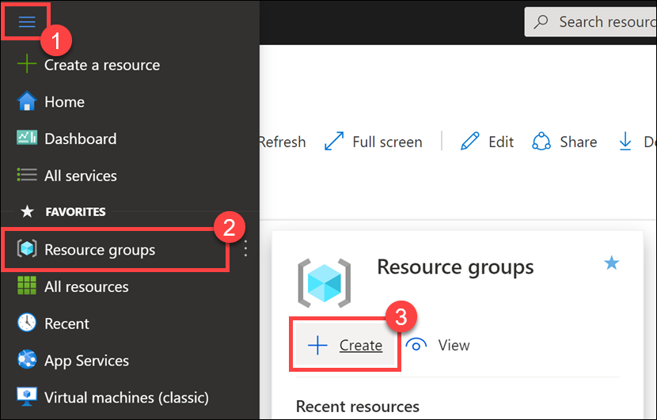

3. On the **Create a resource group** screen, select your desired Subscription and Region. For Resource group, enter **`data-engineering-synapse`** (make sure the name is unique), then select the **Review + Create** button. **Copy the resource group name** and save it in Notepad or similar for later reference.

    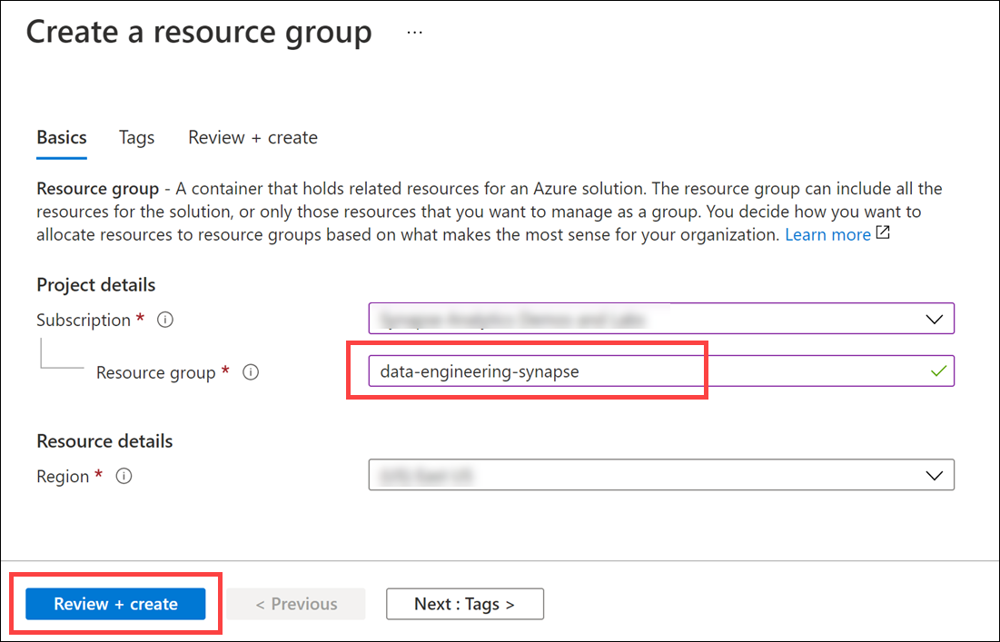

4. Select the **Create** button once validation has passed.

> **Important**: Take note of the _exact_ resource group name you provided for the steps that follow.

### Task 2: Create an Azure VM for the deployment scripts

We highly recommend executing the PowerShell scripts on an Azure Virtual Machine instead of from your local machine. Doing so eliminates issues due to pre-existing dependencies and more importantly, network/bandwidth-related issues while executing the scripts.

1. In the [Azure portal](https://portal.azure.com), type in "virtual machines" in the top search menu and then select **Virtual machines** from the results.

    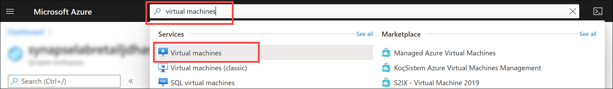

2. Select **+ Add** on the Virtual machines page and then select the **Virtual machine** option.

3. In the **Basics** tab, complete the following:

   | Field                          | Value                                              |
   | ------------------------------ | ------------------------------------------         |
   | Subscription                   | _select the appropriate subscription_              |
   | Resource group                 | _select `data-engineering-synapse` (the name of the resource group you created in the previous task)_                      |
   | Virtual machine name           | _`synapse-lab-setup-vm` (or unique name if not available)_      |
   | Region                         | _select the resource group's location_             |
   | Availability options           | _select `No infrastructure redundancy required`_   |
   | Image                          | _select `Windows 10 Pro, Version 1809 - Gen1`_     |
   | Azure Spot instance            | _set to `Unchecked`_                                      |
   | Size                           | _select `Standard_D8s_v3`_                         |
   | Username                       | _select `labuser`_                             |
   | Password                       | _enter a password you will remember_               |
   | Public inbound ports           | _select `Allow selected ports`_                    |
   | Select inbound ports           | _select `RDP (3389)`_                              |
   | Licensing                      | _select the option to confirm that you have an  eligible Windows 10 license with multi-tenant hosting rights._ |

   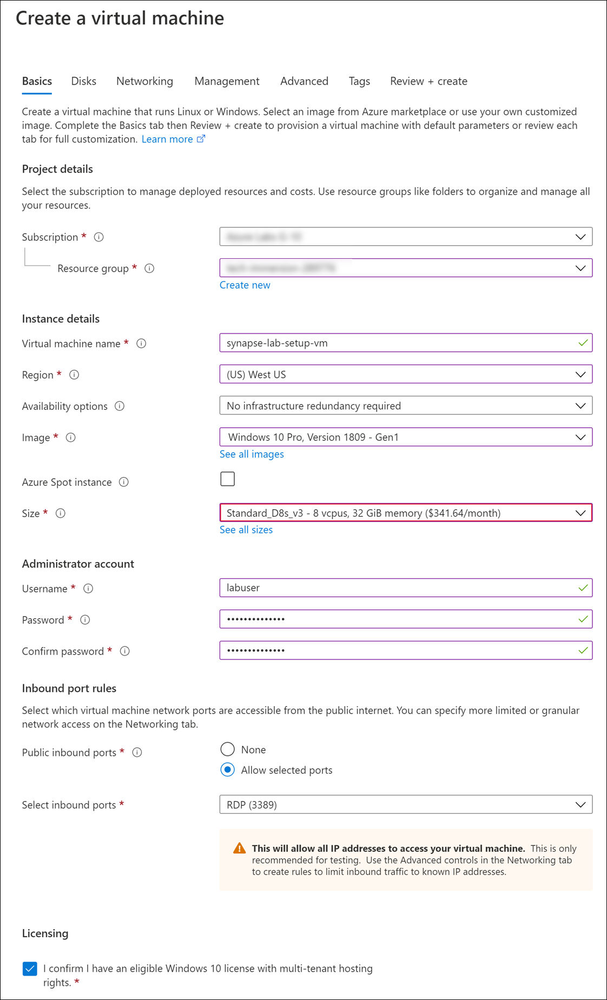

4. Select **Review + create**. On the review screen, select **Create**. After the deployment completes, select **Go to resource** to go to the virtual machine.

    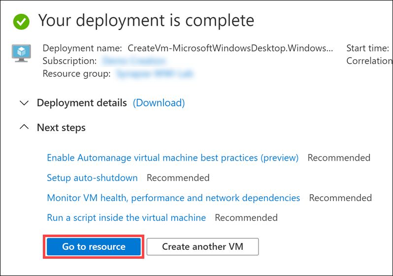

5. Select **Connect** from the actions menu and choose **RDP**.

    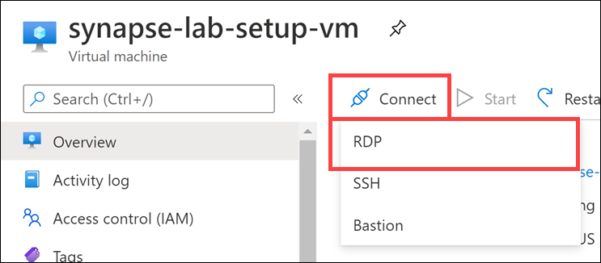

6. On the **Connect** tab, select **Download RDP File**.

    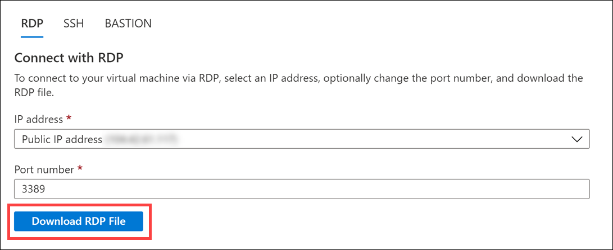

7. Open the RDP file and select **Connect** to access the virtual machine. When prompted for credentials, enter `labuser` for the username and the password you chose.

    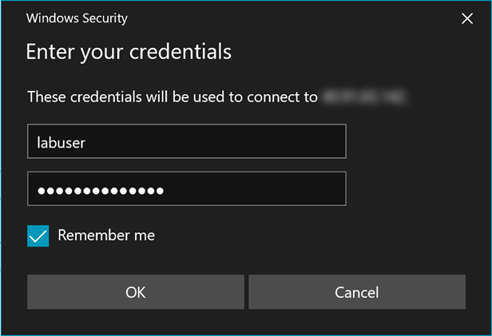

    Click Yes to connect despite security certificate errors when prompted.

    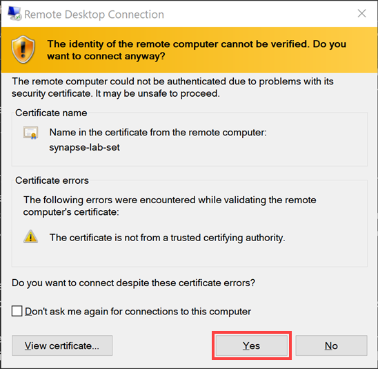

### Task 4: Create Azure Synapse Analytics workspace

1. Deploy the workspace through the following Azure ARM template (press the button below):

    <a href="https://portal.azure.com/#create/Microsoft.Template/uri/https%3A%2F%2Fraw.githubusercontent.com%2Fsolliancenet%2Fmicrosoft-data-engineering-ilt-deploy%2Fmain%2Fsetup%2F04%2Fartifacts%2Fenvironment-setup%2fautomation%2F00-asa-workspace-core.json" target="_blank"></a>

2. On the **Custom deployment** form fill in the fields described below.

   - **Subscription**: Select your desired subscription for the deployment.
   - **Resource group**: Select the resource group you previously created.
   - **Region**: The datacenter where your Azure Synapse environment will be created.

        > **Important**: The `Region` field under 'Parameters' will list the Azure regions where Azure Synapse Analytics is available as of November 2020. This will help you find a region where the service is available without being limited to where the resource group is defined.

   - **Unique Suffix**: This unique suffix will be used naming resources that will created as part of your deployment. Make sure you follow correct Azure [Resource naming](https://docs.microsoft.com/en-us/azure/cloud-adoption-framework/ready/azure-best-practices/naming-and-tagging#resource-naming) conventions.
   - **SQL Administrator Login Password**: Provide a strong password for the SQLPool that will be created as part of your deployment. [Visit here](https://docs.microsoft.com/en-us/sql/relational-databases/security/password-policy?view=sql-server-ver15#password-complexity) to read about password rules in place. Your password will be needed during the next steps. Make sure you have your password noted and secured.

3. Select the **Review + create** button, then **Create**. The provisioning of your deployment resources will take approximately 13 minutes. **Wait** until provisioning successfully completes before continuing. You will need the resources in place before running the scripts below.

    > **Note**: You may experience a deployment step failing in regards to Role Assignment. This error may safely be ignored.

## Before starting

## Steps & Timing

The entire script will take between 1.5 and 2 hours to complete. Major steps include:

- Configure Synapse resources
- Download all data sets and files into the data lake (~15 mins)
- Execute the setup and execute the SQL pipeline (~30 mins)
- Execute the Cosmos DB pipeline (~25 mins)

### Task 1: Pre-requisites

Install these pre-requisites on your **deployment VM** before continuing.

- Install VC Redist: <https://aka.ms/vs/15/release/vc_redist.x64.exe>
- Install MS ODBC Driver 17 for SQL Server: <https://www.microsoft.com/download/confirmation.aspx?id=56567>
- Install SQL CMD x64: <https://go.microsoft.com/fwlink/?linkid=2082790>
- Install Microsoft Online Services Sign-In Assistant for IT Professionals RTW: <https://www.microsoft.com/download/details.aspx?id=28177>
- Install [Git client](https://git-scm.com/downloads) accepting all the default options in the setup.
- [Windows PowerShell](https://docs.microsoft.com/powershell/scripting/windows-powershell/install/installing-windows-powershell?view=powershell-7)

### Task 2: Download artifacts and install PowerShell modules

Perform all of the steps below from your **deployment VM**:

1. Open a PowerShell Window as an administrator, run the following command to download the artifacts

    ```powershell
    mkdir c:\labfiles

    cd c:\labfiles

    git clone https://github.com/solliancenet/microsoft-data-engineering-ilt-deploy.git data-engineering-ilt-deployment
    ```

* Install Azure PowerShell module

    Open Windows PowerShell as an Administrator on your desktop and execute the following:

    ```powershell
    if (Get-Module -Name AzureRM -ListAvailable) {
        Write-Warning -Message 'Az module not installed. Having both the AzureRM and Az modules installed at the same time is not supported.'
        Uninstall-AzureRm -ea SilentlyContinue
        Install-Module -Name Az -AllowClobber -Scope CurrentUser
    } else {
        Install-Module -Name Az -AllowClobber -Scope CurrentUser
    }
    ```

    > [!Note]: You may be prompted to install NuGet providers, and receive a prompt that you are installing the module from an untrusted repository. Select **Yes** in both instances to proceed with the setup

* Install `Az.CosmosDB` module

    ```powershell
    Install-Module -Name Az.CosmosDB -AllowClobber
    ```

    > [!Note]: If you receive a prompt that you are installing the module from an untrusted repository, select **Yes to All** to proceed with the setup.

* Install `sqlserver` module

    ```powershell
    Install-Module -Name SqlServer -AllowClobber
    ```

* Install Azure CLI

    ```powershell
    Invoke-WebRequest -Uri https://aka.ms/installazurecliwindows -OutFile .\AzureCLI.msi; Start-Process msiexec.exe -Wait -ArgumentList '/I AzureCLI.msi /quiet'; rm .\AzureCLI.msi
    ```

**IMPORTANT**

* Once the last command has completed, **close the Windows PowerShell window** so you can import the newly installed Az.CosmosDB cmdlet.

### Task 3: Execute setup scripts

Perform all of the steps below from your **deployment VM**:

* Open Windows PowerShell as an Administrator and execute the following:

    ```powershell
    Set-ExecutionPolicy Unrestricted
    ```

    > [!Note]: If you receive a prompt that you are installing the module from an untrusted repository, select **Yes to All** to proceed with the setup.

* Execute the following to import the `Az.CosmosDB` module:

    ```powershell
    Import-Module Az.CosmosDB
    ```

* Change directories to the root of this repo within your local file system.

    ```powershell
    cd c:\labfiles\data-engineering-ilt-deployment\setup\04\artifacts\environment-setup\automation\
    ```

* Execute `Connect-AzAccount` and sign in to your Microsoft user account when prompted.

    > [!WARNING]: You may receive the message "TenantId 'xxxxxx-xxxx-xxxx-xxxx' contains more than one active subscription. The first one will be selected for further use. You can ignore this at this point. When you execute the environment setup, you will choose the subscription in which you deployed the environment resources.

* Execute `az login` and sign in to your Microsoft user account when prompted.

    > If you receive the following error, and have already closed and re-opened the PowerShell window, you need to restart your computer and restart the steps in this task: `The term 'az' is not recognized as the name of a cmdlet, function, script file, or operable program`.

* Execute `.\01-environment-setup.ps1`

1. You will be prompted to setup your Azure PowerShell and Azure CLI context.

2. If you have more than one Azure Subscription, you will be prompted to enter the name of your desired Azure Subscription. You can copy and paste the value from the list to select one. For example:

    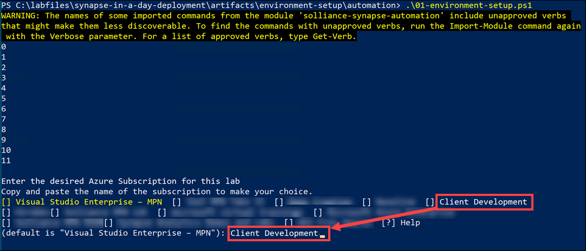

3. Enter the name of the resource group you created at the beginning of the environment setup (such as `data-engineering-synapse`). This will make sure automation runs against the correct environment you provisioned in Azure.

    During the execution of the automation script you may be prompted to approve installations from PS-Gallery. Please approve to proceed with the automation.

    

    > **NOTE** This script will take between 90 and 150 minutes to complete.

#### Potential errors that you can ignore

You may encounter a few errors and warnings during the script execution. The errors below can safely be ignored:

1. The following error may occur when creating SQL users and adding role assignments in the dedicated SQL pool, and can safely be ignored: `Principal 'xxx@xxx.com' could not be created. Only connections established with Active Directory accounts can create other Active Directory users.`

    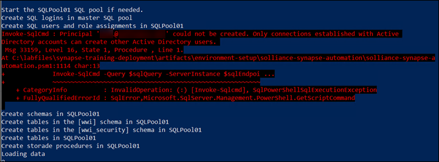

2. Toward the end of the script, you may see the following error. If you do, it can be safely ignored:

    ```PowerShell
    Starting PowerBI Artifact Provisioning
    Invoke-WebRequest : The response content cannot be parsed because the Internet Explorer engine is not available, or Internet Explorer's first-launch configuration is not complete. Specify the UseBasicParsing parameter and try again.
    At C:\labfiles\data-engineering-ilt-deployment\setup\04\artifacts\environment-setup\solliance-synapse-automation\solliance-synapse-automation. char:15
    + ...   $result = Invoke-WebRequest -Uri $url -Method GET -ContentType "app ...
    +                 ~~~~~~~~~~~~~~~~~~~~~~~~~~~~~~~~~~~~~~~~~~~~~~~~~~~~~~~~~
        + CategoryInfo          : NotImplemented: (:) [Invoke-WebRequest], NotSupportedException
        + FullyQualifiedErrorId : WebCmdletIEDomNotSupportedException,Microsoft.PowerShell.Commands.InvokeWebRequestCommand

    Cannot index into a null array.
    At C:\labfiles\data-engineering-ilt-deployment\setup\04\artifacts\environment-setup\solliance-synapse-automation\solliance-synapse-automation. char:5
    +     $homeCluster = $result.Headers["home-cluster-uri"]
    +     ~~~~~~~~~~~~~~~~~~~~~~~~~~~~~~~~~~~~~~~~~~~~~~~~~~
        + CategoryInfo          : InvalidOperation: (:) [], RuntimeException
        + FullyQualifiedErrorId : NullArray
    ```

### Task 4: Pause SQL pool

> **Note:**
> 
> If you are **not** planning on using the Synapse workspace environment right away, follow the steps in this task to pause the SQL pool. Otherwise, you will incur potentially significant cost.

1. Navigate to the resource group into which you deployed this environment.

2. Select the **Dedicated SQL pool** (`SQLPool01`).

    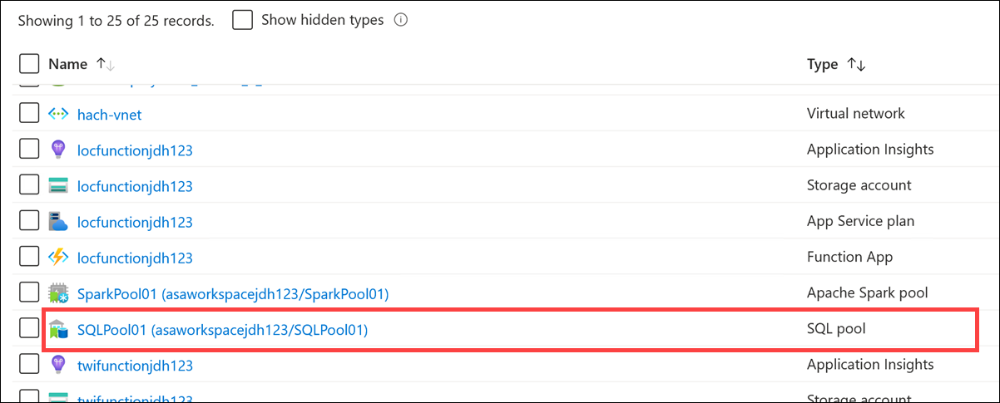

3. Select **|| Pause** to pause the pool.

    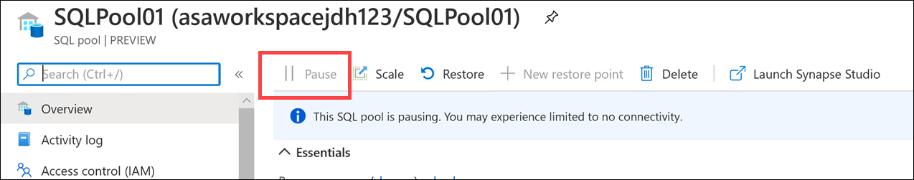

### Task 6: Delete lab setup VM

You no longer need the virtual machine if you created one for this lab setup.

1. Open the VM in your Azure resource group, select **Delete**, then select **Yes** when prompted.

    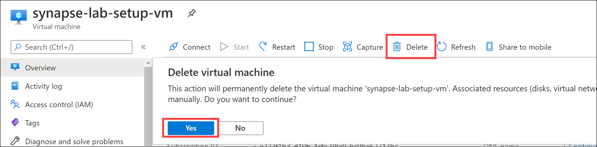

<!-- ### Task 8: Location Analytics Streaming Dataset Setup

1. Log into the [Azure Portal](https://portal.azure.com) using your Azure credentials.

2. On the Azure Portal home screen, go to **Search** and search for **locfunction**. Once the azure function is found select it to proceed.


3. Select **Functions** from the left menu to list the functions available in the function app. Next, select the function named **Start**.


4. In the **Overview** tab select **Get Function Url** and select **Copy to clipboard** to copy the Url for the function into your clipboard.


5. Open a new browser tab, paste the url and navigate to function endpoint to start location analytics data generator.


6. Once the Azure Function starts you can start building Power BI real-time reports for your new Power BI dataset. The name of the dataset is the value you provided during Task 2.4 of this setup guide.


### Task 9: Twitter Analytics Streaming Dataset Setup

1. Log into the [Azure Portal](https://portal.azure.com) using your Azure credentials.

2. On the Azure Portal home screen, go to **Search** and search for **tweets**. If you provided a different name for you Azure Stream Analytics Job use the same name for your search term.


3. Select **Start** to start the Azure Stream Analytics Job.


4. Once the job starts gathering data you can start building Power BI real-time reports for your new Power BI dataset that will be create by the Azure Stream Analytics job. The name of the dataset is based on the value you provided for the configuration parameter named **Streaming dataset** during template deployment.

### Task 10: Twitter Analytics Report

1. Launch [Power BI Desktop](https://powerbi.microsoft.com/en-us/desktop/) on your machine.

2. **Sign in** using your Power BI account credentials.


3. Select **Get Data** from the **Home** toolbar. Select **Power BI datasets** to proceed.


4. Select **Tweetsout** from the list of datasets. The name of the dataset is based on the value you provided for the configuration parameter named **Streaming dataset** during template deployment. It might be different in your case if you have changed the default value during deployment.

> Please note, it make take several minutes for this dataset to show up on the list. The Stream Analytics job you started in the previous task sends data to Power BI. There is an initial delay before the dataset initially appears after receiving the initial load of streaming data. If you do not see it listed, select Cancel to close this dialog, then re-open it.


5. To create **Tweets by City Visualization**, which is the count of neutral sentiment tweets over a geographical region, select the map icon from the Visualization tray.


6. Select **city**, **sentiment** and **tweet** fields to be included into the report. Move the **Tweet** field into the **Size** section.


7. Save your report locally, and then publish it to your workspace to be used during your demo. _This is the workspace you created in Task 1_.

### Task 11: Location Analytics Real-Time Report

1. Launch [Power BI Desktop](https://powerbi.microsoft.com/en-us/desktop/) on your machine.

2. **Sign in** using your Power BI account credentials.


3. Select **Get Data** from the **Home** toolbar. Select **Power BI datasets** to proceed.


4. Select **locationstream** from the list of datasets. The name of the dataset is the value you provided during Task 2.4 of this setup guide. It might be different in your case if you picked a different name.


5. To create a **Lined and stacked column Chart** for Avg Visit Time and Visitors by customer segment and department with the help of real-time data, select the map icon from the Visualization tray.


6. Select **CustomerSegment**, **DeptName**, **VisitorId** and **VisitTime** fields to be included into the report. 


7. Move **VisitTime** to Column Values and select to use its **average** value. Move **VisitorId** to Line values and select its **count** value to be used in the report.


8. Save and publish your report to your workspace to be used during your demo.

### Task 12: Power BI Dashboard 

1. Sign in into the [Power BI Portal](https://powerbi.microsoft.com/en-us/) using your Azure credentials.

2. Select **Workspaces** from the left menu and select the **CDP** workspace you previously created.


3. Name your dashboard **CDP**.

4. Select **Workspaces** from the left menu and select the **CDP** workspace you previously created.


5. Select **Phase2 CDP Vision Demo** report.

6. Select **Pin Visual** from any of the tiles available in the report to pin it into your dashboard.


7. Select the **CDP** dashboard and select **Pin**.


So far, you have pinned one tile from a single report to your dashboard. Feel free to navigate to different reports and pin the tiles you find appropriate to create your dashboard to achieve the look presented below.


The dashboard shown above has images used on the top row and the first column to the left. These images are available in a report called **Dashboard-images**. You can access all images from **Dashboard-images** to pin it into your design. -->

<!-- ## Optional Features

### 30 Billion Rows Dataset

The WWI environment can be populated with 30 billion records to demonstrated large data scenarios. Due to the limits of Azure Cloud Shell's 20-minute runtime, the automation has to run on a stand-alone machine against your subscription to be able to go through the 4-5 hours long data loading process. If you decide to go with the 30 billion records option, use a local Powershell instance with admin privileges instead of Azure Cloud Shell.

1. [Install Azure CLI](https://docs.microsoft.com/en-us/cli/azure/install-azure-cli?view=azure-cli-latest) and [Git](https://git-scm.com/downloads) to your computer.

2. Navigate to a folder location you prefer on your computer and execute the command below to download automation scripts and artifacts.


    ```PowerShell
    git clone https://github.com/microsoft/Azure-Analytics-and-AI-Engagement.git synapse-wwi
    ```
    
    

3. Execute the following command to authenticate your powershell session with your Azure Subscription:

    ```cli
    az login
    ```
    
4. Execute the following command to authenticate the script session with your Azure Subscription:

    ```cli
    Connect-AzAccount
    ```
    
5. Continue your environment setup from [Task 7 in the Before Starting guide](#task-7-run-environment-setup-powershell-script)).

### Twitter Developer Account Application

The Twitter Real-Time Analytics report in you created during task 10 can be connected to the real world, and fetch real-time tweets from twitter instead of the simulator deployed as part of your environment. In order to connect your report to Twitter you will need a Twitter Developer Account. Below are the steps to apply for one.

1. Visit [Twitter Developer Portal](https://developer.twitter.com/en/apply-for-access) to start your application for a Twitter Developer Account.

2. Select **Apply for a developer account** to start your application.


3. Select **Building B2B products** for your reason to build your application.


4. Make sure all information is correct and **Team developer account** is selected for your application.


5. In this step you will have to explain how you plan to use your developer account. Fill in your reasoning with your own words. Make sure you toggle the **Are you planning to analyze Twitter data** question **ON**.


6. During the next step you will be asked to confirm your e-mail by clicking a link in an e-mail sent to your e-mail address attached to your Twitter account. Select the link in your e-mail and verify your e-mail address.


7. Now your application is complete. It will be reviewed by Twitter, and you will receive a confirmation e-mail soon.


 -->
