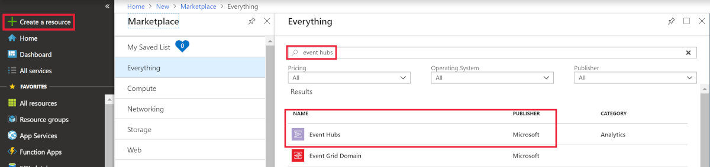
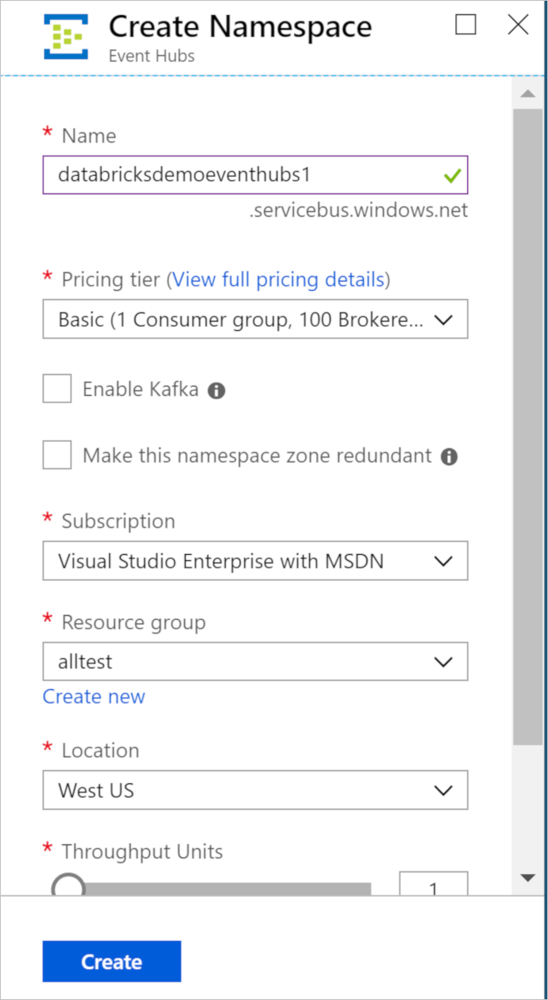
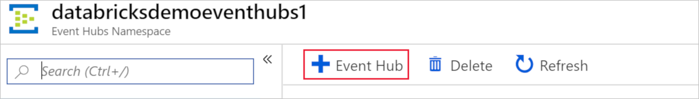
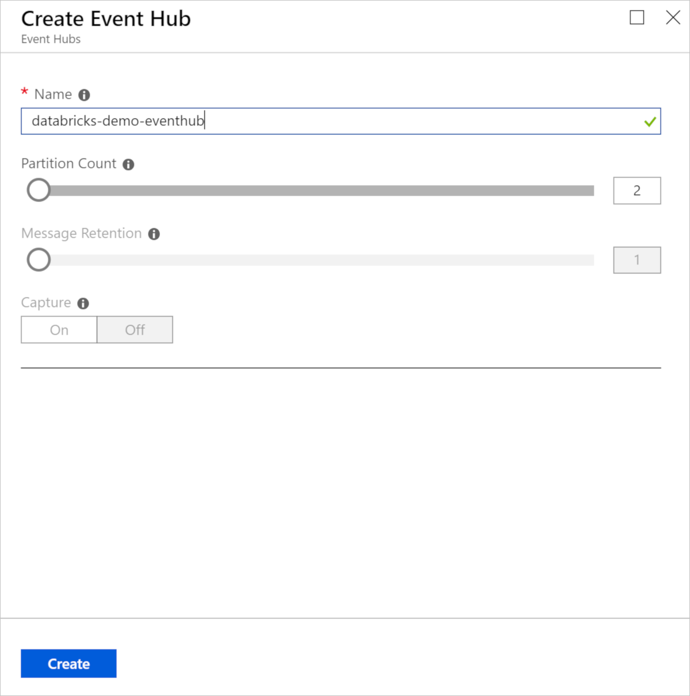
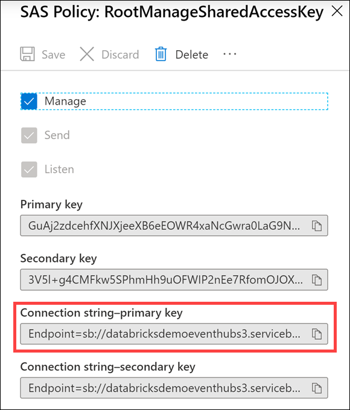
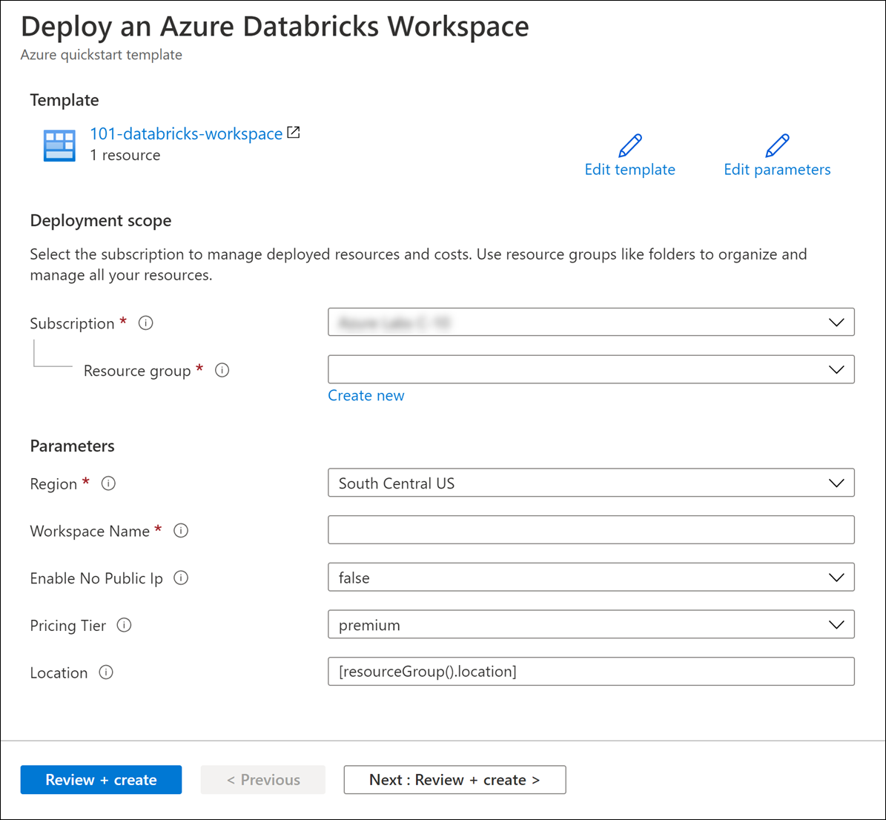
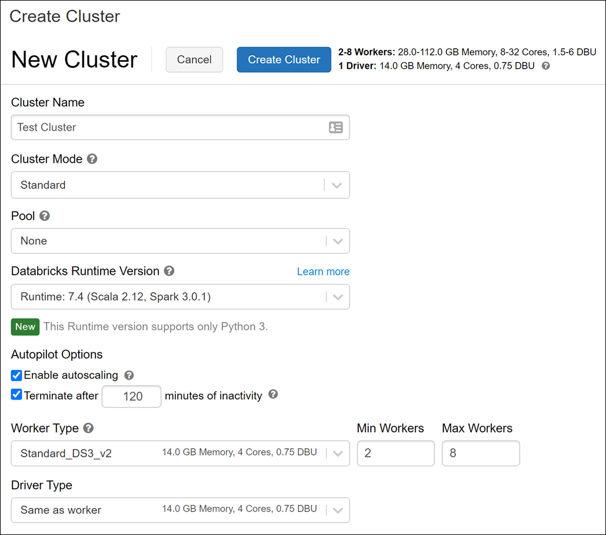

# Module 15 - Lab setup

**Microsoft Azure Account**: You will need a valid and active Azure account for the Azure labs. If you do not have one, you can sign up for a [free trial](https://azure.microsoft.com/en-us/free/)

- If you are a Visual Studio Active Subscriber, you are entitled for a $50-$150 credit per month. You can refer to this [link](https://azure.microsoft.com/en-us/pricing/member-offers/msdn-benefits-details/) to find out more including how to activate and start using your monthly Azure credit.

- If you are not a Visual Studio Subscriber, you can sign up for the FREE [Visual Studio Dev Essentials](https://www.visualstudio.com/dev-essentials/) program to create Azure free account (includes 1 year of free services, $200 for 1st month).

## Create the required resources

To complete this lab, you will need to create an event hub and deploy an Azure Databricks workspace in your Azure subscription.

### Create an Event Hubs namespace

1. In the Azure portal, select **+ Create a resource**. Enter event hubs into the Search the Marketplace box, select Event Hubs from the results, and then select **Create**.

   

2. In the Create Namespace pane, enter the following information:

   - **Subscription**: Select the subscription group you're using for this module.
   - **Resource group**: Choose your module resource group.
   - **Namespace name**: Enter a unique name, such as **databricksdemoeventhubs**. Uniqueness will be indicated by a green check mark.
   - **Location**: Select the location you're using for this module.
   - **Pricing tier**: Select **Basic**.

   Select **Review + create**, then select **Create**.

   

### Create an event hub

1. After your Event Hubs namespace is provisioned, browse to it and add a new event hub by selecting the **+ Event Hub** button on the toolbar.

   

2. On the **Create Event Hub** pane, enter:

   - **Name**: Enter `databricks-demo-eventhub`.
   - **Partition Count**: Enter **2**.

   Select **Create**.

   

### Copy the connection string primary key for the shared access policy

1. On the left-hand menu in your Event Hubs namespace, select **Shared access policies** under **Settings**, then select the **RootManageSharedAccessKey** policy.

   

2. Copy the connection string for the primary key by selecting the copy button.

   

3. Save the copied primary key to Notepad.exe or another text editor for later reference.

### Deploy an Azure Databricks workspace

1. Click the following button to open the ARM template in the Azure Portal.
   
   

1. Provide the required values to create your Azure Databricks workspace:

   - **Subscription**: Choose the Azure Subscription in which to deploy the workspace.
   - **Resource Group**: Leave at Create new and provide a name for the new resource group.
   - **Region**: Select a location near you for deployment. For the list of regions supported by Azure Databricks, see [Azure services available by region](https://azure.microsoft.com/regions/services/).
   - **Workspace Name**: Enter a unique name for your workspace.
   - **Enable No Public Ip**: Set to `false`.
   - **Pricing Tier**: Ensure `premium` is selected.
   - **Location**: Leave this at the default `[resourceGroup()location]` value.

   

1. Select **Review + create**.
1. Select **Create**.
1. The workspace creation takes a few minutes. During workspace creation, the portal displays the Submitting deployment for Azure Databricks tile on the right side. You may need to scroll right on your dashboard to see the tile. There is also a progress bar displayed near the top of the screen. You can watch either area for progress.

### Create a cluster

1. When your Azure Databricks workspace creation is complete, select the link to go to the resource.
1. Select **Launch Workspace** to open your Databricks workspace in a new tab.
1. In the left-hand menu of your Databricks workspace, select **Clusters**.
1. Select **Create Cluster** to add a new cluster.

    

1. Enter a name for your cluster, such as `Test Cluster`.
1. Select the **Databricks RuntimeVersion**. We recommend the latest runtime and **Scala 2.12**.
1. Select the default values for the cluster configuration.
1. Select **Create Cluster**.
